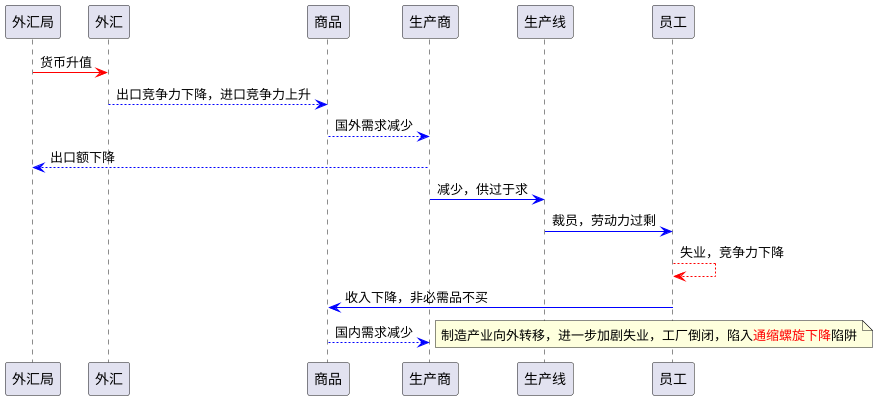

# Thoughts on the Lost Generation in China at this time

## Us in China? A Lost Generation? To Repeat Japan or Not?

Trump started the United States–China trade war in January 2018. The economic conflict between China and the United States has been ongoing.

In 1985, during the Plaza Accord, Japan sharply revalued the yen overnight. Endaka is this state in which the value of the Japanese yen is high compared to other currencies.

### Currency appreciation and depreciation

When a country's currency appreciates in relation to foreign currencies, foreign goods become cheaper in the domestic market and
there is overall downward pressure on domestic prices. In contrast, the prices of domestic (/də'mestɪk/ 国内的;本国的) goods paid by foreigners go up, which tends to decrease foreign demand for domestic products.
Also, depreciation (/dɪˌpriːʃi'eɪʃn/ 货币贬值;跌价) of a currency tends to improve the competitiveness of domestic goods in foreign markets while making foreign goods less competitive in the domestic market by becoming more expensive.

In the international asset transactions, a change in a currency's value may give rise to a foreign exchange gain or loss. The appreciation of
the domestic currency raises the value of the holdings of foreign assets denominated (/dɪ'nɒmɪneɪt/ 为...命名;把...称作...) in that currency.

## Difficulties of Live streamer in China

The only way to change that is to make policy dependent on what people at the bottom want, not those on the top.

However, it is clear that society does not operate according to an individual's will.

As Wuhan writer Fang Fang (方方) once said, a speck of dust in the era can become a mountain when it falls on an individual.
And we happen to live in an era filled with dust and grime.

When the country's economy is in a state of recession, the economic growth of the country is slowed down.

She graduated from Lanzhou University and firmly believed in becoming a better live streamer and earning more money.

When she was in the rise phase, she chose to go to university to pursue a master's degree.

**Jigglypuff** is such a live streamer.

## References

 - [x] [Lost Decades](https://en.wikipedia.org/wiki/Lost_Decades)
 - [x] [Endaka](https://en.wikipedia.org/wiki/Endaka)
 - [x] [Currency appreciation and depreciation](https://en.wikipedia.org/wiki/Currency_appreciation_and_depreciation)
